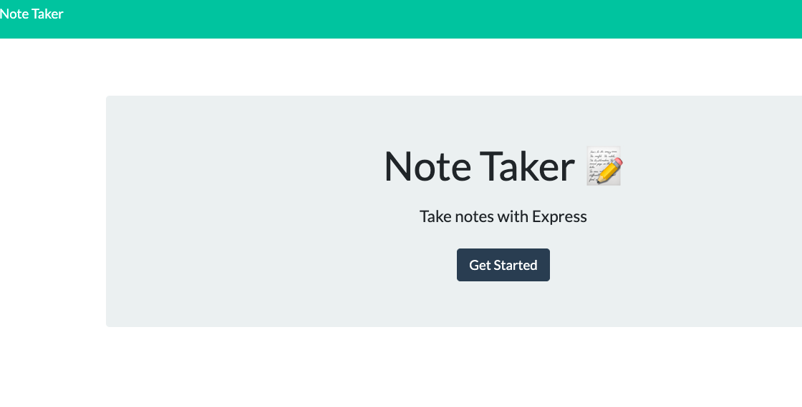
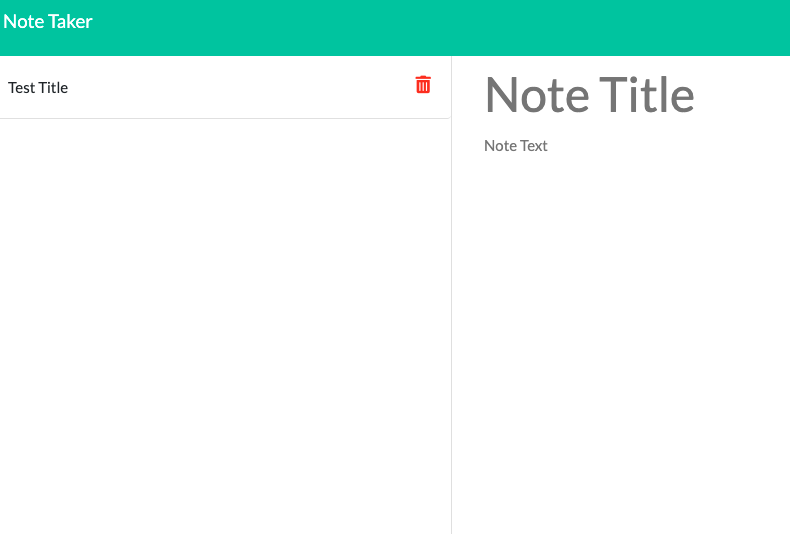
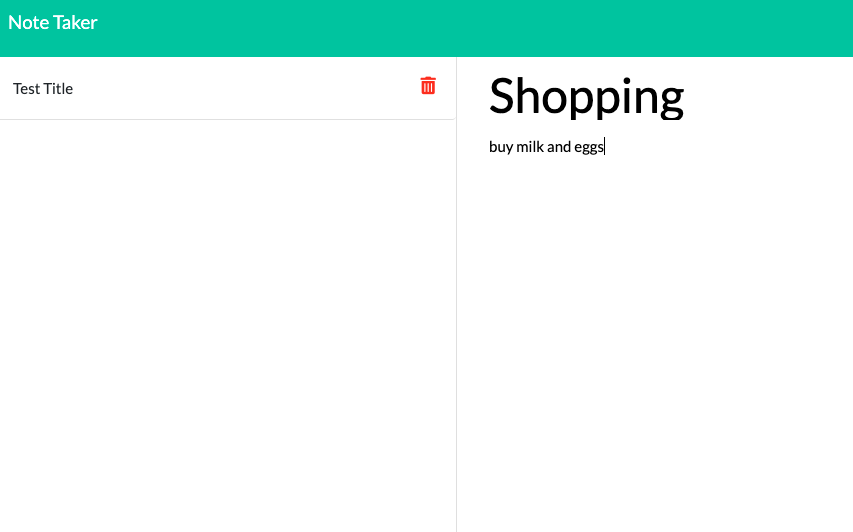
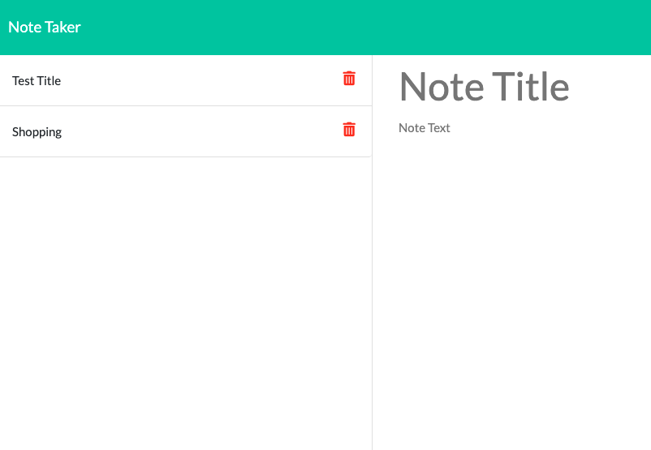
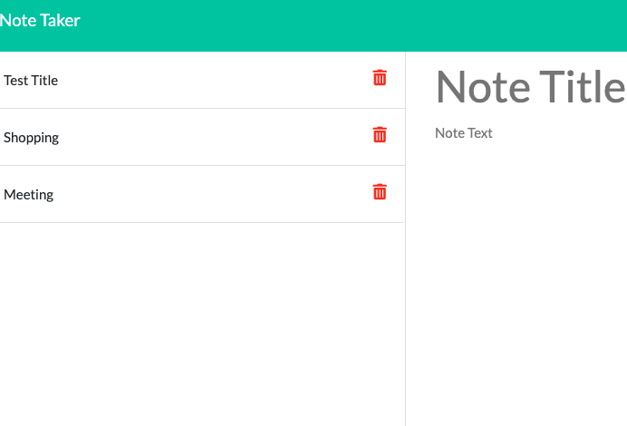
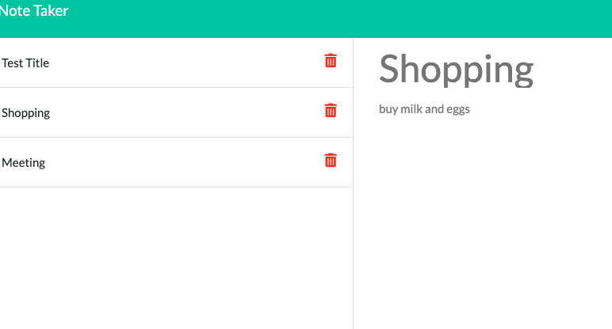

[]
# Express Note Taker
 
## Description 

This is an app that allows the user to create and save notes.  The user can write a note with a title and text, and then save this note.  When the note is saved, it appears in a column on the left.  The user can create as many notes as they would like.  User input is stored in a JSON file.

 ## Table of Contents: 

 * [User-Story](#userstory)
 *[Installation](#installation)
 *[Usage](#usage)
 *[Contribution](#contribution)
 *[License](#license) 
 *[Tests](#tests) 
 *[Questions](#questions)

## User_Story

This is an app that helps the user keep track of and organize tasks they need to complete.  The user can easily add and access notes that need to be completed.  It simplifies the many hassels of a busy life.

## Installation

 node js, uuid

## Usage 

Click on link for a video demonstration:
https://drive.google.com/file/d/1yFYZmnRRtr-iysNjJdN_DdfbZtUFimdE/view

## Contribution 

 none

## Tests 
none

## Questions 

 If you have further questions, please email me at: mcn4c@virginia.edu.
 For access to this and my other repositories, please click the following link to my GitHub page: https://github.com/mcn4c. 

## License
https://www.apache.org/licenses/LICENSE-2.0